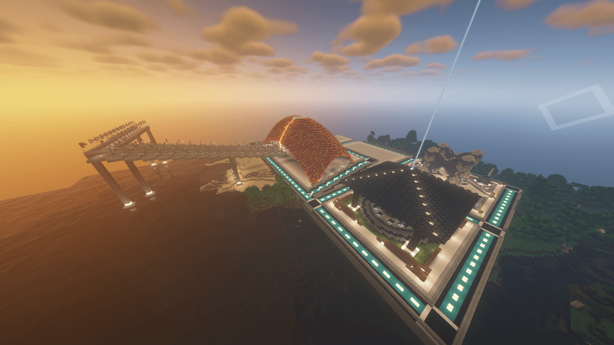

# 生存一区

一个以 <mark style="color:yellow;">**原版生存**</mark> 为主的区服 ， <mark style="color:red;">**不推荐生电玩家在此区服建造机器！**</mark>

但鉴于原版内容较为单一，故一区在原版内容上进行了<mark style="color:orange;">**数据包/插件扩展**</mark>


数据包内容仅为扩展，不影响原版任何内容，可放心游玩


### 建议玩法

**主生存区服**，如需_建造机器或不适应/卡顿_ 再考虑其他区服

可建筑可养老，拥有玩家第一选择

### 插件列表

1. \[扫地大妈]AdvancedCleaner
2. \[更好的末影龙复活]BetterDragon
3. \[受伤画面变红]BloodFading
4. \[睡觉回血]BedRegen
5. \[更多附魔]ExcellentEnchants
6. \[击杀显示]MultiKillTitle
7. \[重生无敌]RespawnInvulnerable
8. \[缰绳]Tether
9. \[tpa]LiteTeleport
10. \[多人跳夜晚]sleep-most
11. \[点歌]ZMusic

### 插件说明

| 插件名                                                                       | 介绍                                                                                          |   |
| ------------------------------------------------------------------------- | ------------------------------------------------------------------------------------------- | - |
| \[更好的末影龙复活]BetterDragon                                                   |  一个有几率BOSS末影龙的插件，可显示击杀榜                                                                     |   |
| [\[更多附魔\]ExcellentEnchants](https://www.mcbbs.net/thread-867086-1-1.html) | 额外扩展超多属性附魔，具体列表请看MCBBS超链                                                                    |   |
| \[点歌]ZMusic                                                               | 指令/zm play 163 \[歌名-歌手] 来进行点歌 [\[视频演示点我\]](https://www.bilibili.com/video/av92156922?t=0.5) |   |

### 使用数据包列表:

点击名字查看详情

1. <mark style="color:red;">****</mark>[<mark style="color:red;">**\[9种矿井\]hopobettermineshaft**</mark>](https://www.planetminecraft.com/data-pack/better-mineshafts/)<mark style="color:red;">****</mark>
2. [\[改进的荒漠村\]desert-village](https://www.planetminecraft.com/data-pack/1-14-x-improved-desert-village-datapack/)
3. [\[更好的村庄\]Better-Village](https://www.planetminecraft.com/data-pack/better-villages-custom-medieval-village/)
4. [\[更好的古城战利品\]improvedancientcities](https://www.planetminecraft.com/data-pack/ancient-city-loot-improvements/)
5. ****[<mark style="color:red;">**\[更好的水下废墟\]hopobetterunderwaterruins**</mark>](https://www.planetminecraft.com/data-pack/better-underwater-ruins-underwater-cities-and-cave-structures/)<mark style="color:red;">****</mark>
6. [\[红树林沼泽洞穴\]mangrove-swamp-caves](https://www.planetminecraft.com/data-pack/mangrove-swamp-caves/)
7. [\[斯普拉图斯的山村\]splatus-mountain-villages](https://www.planetminecraft.com/data-pack/splatus-s-mountain-villages-v1-0-1-18-2/)
8. [\[苔藓废墟\]moss-ruins-datapack](https://www.planetminecraft.com/data-pack/moss-ruins-datapack/)
9. [\[新毁坏的传送门\]New-Ruined-Portals](https://www.planetminecraft.com/data-pack/new-ruined-portals-better-structures/)
10. [\[新沙漠寺庙\]New-Desert-Temple](https://www.planetminecraft.com/data-pack/new-desert-temples-better-structures/)
11. ****[<mark style="color:red;">**\[新终点城市\]New-End-Cities**</mark>](https://www.planetminecraft.com/data-pack/new-end-cities-better-structures/)<mark style="color:red;">****</mark>
12. [\[许多村庄\]towns-and-towers-structure](https://www.planetminecraft.com/data-pack/towns-amp-towers-structure-overhaul/)
13. [\[萤火虫\]FireFlies](https://www.planetminecraft.com/data-pack/i-added-fireflies/)
14. <mark style="color:red;">****</mark>[<mark style="color:red;">**\[主世界更多地形\]terralith**</mark>](https://www.planetminecraft.com/data-pack/terralith/)<mark style="color:red;">****</mark>
15. <mark style="color:red;">****</mark>[<mark style="color:red;">**\[更强大的生物与不同的战利品\]grade-my-enemy**</mark>](https://www.planetminecraft.com/data-pack/grade-my-enemy-1-16-2-1-16-5/)<mark style="color:red;">****</mark>


加粗为重点推荐数据包，对地形等机制有较大改变



下面的数据包未经过验证，不确定是否可实现


1. [\[更好的雪量\]unzip-me-bettersnowfall](https://www.planetminecraft.com/data-pack/better-snowfall-1-19/)
2. [\[工具架\]pk-tool-rack](https://www.planetminecraft.com/data-pack/tool-rack-hang-your-tools-and-weapons/)
3. [\[古代地标\]ancient-landmarks](https://www.planetminecraft.com/data-pack/ancient-landmarks-1-19/)
4. [\[航石\]pk-waystones](https://www.planetminecraft.com/data-pack/waystones-a-fast-way-to-travel-in-your-world-with-waypoints/)
5. [\[料斗过滤器\]pk-hopper-filter](https://www.planetminecraft.com/data-pack/hopper-filter-sort-your-items-in-chests-more-easily/)
6. [\[随处坐\]sit-anywhere](https://www.planetminecraft.com/data-pack/sit-anywhere/)

### 部分截图

   
